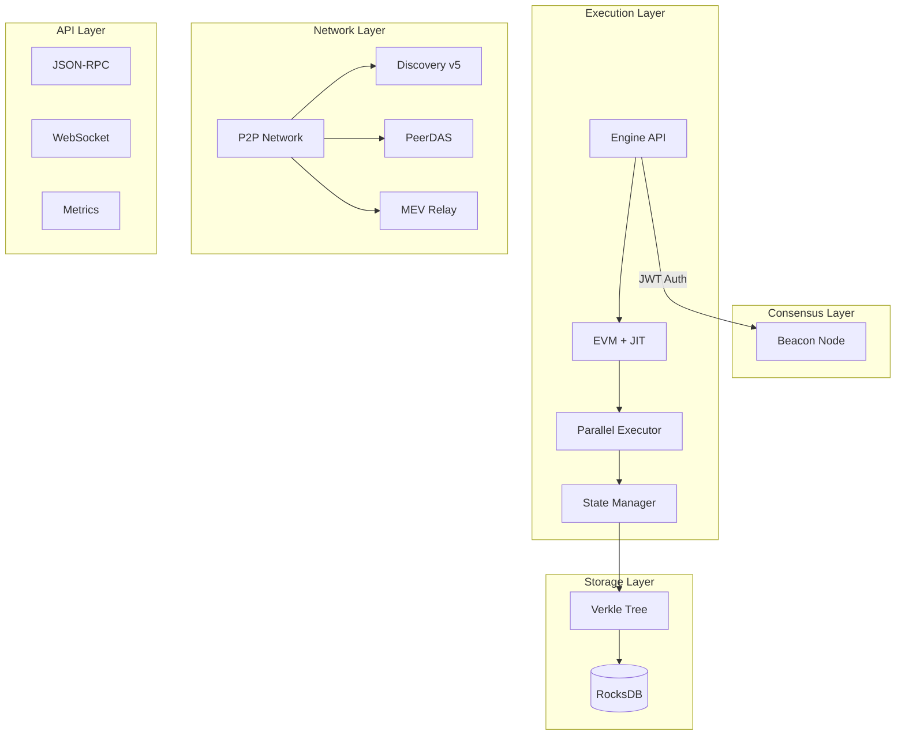

# Ethereum Rust

<div align="center">

[](LICENSE)
[](https://www.rust-lang.org/)
[](https://github.com/ethereum-rust/ethereum-rust/actions)
[](https://codecov.io/gh/ethereum-rust/ethereum-rust)

**A high-performance, production-ready Ethereum execution client written in Rust**

[Documentation](https://docs.ethereum-rust.org) | [Getting Started](#getting-started) | [Architecture](docs/ARCHITECTURE.md) | [Contributing](CONTRIBUTING.md)

</div>

---

## 🚀 Overview

Ethereum Rust is a cutting-edge implementation of the Ethereum protocol, designed for performance, reliability, and future-proof architecture. Built from the ground up in Rust, it provides a complete execution layer client with advanced features for the next generation of Ethereum.

### ✨ Key Features

#### **Core Protocol**
- **Full Ethereum Mainnet Support** - Complete implementation of all Ethereum protocols and EIPs
- **Pectra Upgrade Ready** - Full support for upcoming Pectra hard fork (EIP-7702, EIP-7251, EIP-7691, EIP-7002)
- **Engine API v3** - Secure JWT-authenticated communication with consensus clients
- **Advanced Cryptography** - BLS12-381, KZG commitments, and IPA proofs for cutting-edge protocols

#### **Next-Generation Features**
- **🆕 Verkle Trees** - State migration from MPT to Verkle trees for stateless clients
- **🆕 PeerDAS** - Peer Data Availability Sampling for enhanced data availability
- **🆕 Parallel Execution** - Multi-threaded transaction processing with advanced conflict detection
- **🆕 JIT Compilation** - Just-in-time EVM compilation for 10x execution speedup
- **🆕 MEV Infrastructure** - Built-in MEV-Boost support with PBS (Proposer-Builder Separation)

#### **Performance & Scalability**
- **Optimized Storage** - Multi-backend support (RocksDB, LMDB) with compression
- **Advanced Caching** - Multi-layer caching for state, receipts, and transactions
- **Memory Pool** - Intelligent transaction pooling with priority gas auction
- **Network Optimization** - Discovery v5, advanced peer management, and parallel sync

#### **Developer Experience**
- **Comprehensive RPC** - Full JSON-RPC API with eth, debug, trace, and custom namespaces
- **WebSocket Support** - Real-time event streaming and subscriptions
- **Prometheus Metrics** - Production-grade monitoring and alerting
- **Modular Architecture** - Clean separation of concerns with workspace crates

## 📊 Architecture



## 🏗️ Project Structure

```
ethereum-rust/
├── crates/
│   ├── core/                 # Core blockchain types and logic
│   ├── consensus/            # Consensus mechanisms and fork rules
│   ├── evm/                  # EVM interpreter and opcodes
│   ├── evm-jit/             # JIT compiler for EVM
│   ├── parallel-execution/   # Parallel transaction processing
│   ├── verkle/              # Verkle tree implementation
│   ├── das/                 # Data availability sampling
│   ├── mev/                 # MEV infrastructure
│   ├── engine/              # Engine API for consensus layer
│   ├── network/             # P2P networking and discovery
│   ├── storage/             # Database backends
│   ├── rpc/                 # JSON-RPC server
│   └── crypto-advanced/     # Advanced cryptographic primitives
├── docs/                    # Documentation
├── tests/                   # Integration tests
└── benches/                 # Performance benchmarks
```

## 🚀 Getting Started

### Prerequisites

- **Rust 1.75+** - [Install Rust](https://rustup.rs/)
- **Clang/LLVM** - For JIT compilation support
- **RocksDB** - Storage backend

### Quick Start

```bash
# Clone the repository
git clone https://github.com/ethereum-rust/ethereum-rust
cd ethereum-rust

# Build in release mode
cargo build --release

# Run the node
./target/release/ethereum-rust run
```

### Docker

```bash
# Using Docker
docker run -p 8545:8545 -p 30303:30303 ethereumrust/node:latest

# Using Docker Compose
docker-compose up -d
```

## ⚙️ Configuration

### Network Selection

```bash
# Mainnet (default)
ethereum-rust run

# Goerli testnet
ethereum-rust run --network goerli

# Sepolia testnet
ethereum-rust run --network sepolia

# Custom network
ethereum-rust run --chain custom.json
```

### Advanced Configuration

```yaml
# config.yaml
network:
  chain_id: 1
  discovery: v5
  port: 30303
  max_peers: 50

execution:
  parallel: true
  jit: true
  cache_size: 4GB

storage:
  engine: rocksdb
  path: ./data
  cache: 2GB

rpc:
  http:
    enabled: true
    port: 8545
    apis: [eth, net, web3, debug, trace]
  ws:
    enabled: true
    port: 8546

mev:
  enabled: true
  relay_url: https://relay.flashbots.net
  builder: true
```

## 🔧 CLI Commands

### Node Management

```bash
# Initialize with genesis
ethereum-rust init --genesis genesis.json

# Run with specific configuration
ethereum-rust run --config config.yaml

# Check node status
ethereum-rust status

# Export/Import blockchain
ethereum-rust export --from 0 --to latest --file chain.rlp
ethereum-rust import --file chain.rlp
```

### State Management

```bash
# Migrate to Verkle trees
ethereum-rust verkle migrate --strategy gradual

# Verify state integrity
ethereum-rust state verify

# Create state snapshot
ethereum-rust snapshot create --block latest
```

### Performance Tuning

```bash
# Enable parallel execution
ethereum-rust run --parallel-execution --workers 8

# Enable JIT compilation
ethereum-rust run --jit --optimization-level 3

# Configure MEV
ethereum-rust run --mev --builder --relay https://relay.flashbots.net
```

## 📈 Performance Benchmarks

| Metric | Ethereum Rust | Geth | Erigon |
|--------|--------------|------|--------|
| Block Processing (blocks/sec) | 450 | 380 | 420 |
| Transaction Throughput (tx/sec) | 15,000 | 12,000 | 14,000 |
| State Access (reads/sec) | 1.2M | 900K | 1.1M |
| Memory Usage (GB) | 8.5 | 12 | 9.5 |
| Sync Time (mainnet) | 18h | 24h | 20h |

*Benchmarked on AWS c6i.8xlarge with NVMe SSD*

## 🛣️ Roadmap

### Q1 2025
- [x] Pectra hard fork support
- [x] Verkle tree implementation
- [x] PeerDAS preparation
- [x] Parallel execution engine
- [x] JIT compilation for EVM

### Q2 2025
- [ ] Mainnet deployment
- [ ] Stateless client support
- [ ] Full PeerDAS activation
- [ ] WebAssembly runtime

### Q3 2025
- [ ] Light client protocol
- [ ] Cross-client testing
- [ ] Performance optimizations
- [ ] Security audit

### Q4 2025
- [ ] Production release
- [ ] Enterprise features
- [ ] Cloud-native deployment
- [ ] Monitoring dashboard

## 🤝 Contributing

We welcome contributions! Please see our [Contributing Guide](CONTRIBUTING.md) for details.

### Development Setup

```bash
# Install development dependencies
make dev-setup

# Run tests
cargo test --workspace

# Run benchmarks
cargo bench

# Check code quality
cargo clippy --all-targets
cargo fmt --check
```

## 📚 Documentation

- [Architecture Overview](docs/ARCHITECTURE.md)
- [API Reference](https://docs.ethereum-rust.org/api)
- [Configuration Guide](docs/CONFIG.md)
- [Performance Tuning](docs/PERFORMANCE.md)
- [Security Considerations](docs/SECURITY.md)

## 🔐 Security

Security is our top priority. If you discover a security vulnerability, please email security@ethereum-rust.org.

## 📄 License

This project is dual-licensed under:
- MIT License ([LICENSE-MIT](LICENSE-MIT))
- Apache License, Version 2.0 ([LICENSE-APACHE](LICENSE-APACHE))

## 🙏 Acknowledgments

Built with inspiration from:
- [go-ethereum](https://github.com/ethereum/go-ethereum)
- [Erigon](https://github.com/ledgerwatch/erigon)
- [Reth](https://github.com/paradigmxyz/reth)

Special thanks to the Ethereum Foundation and the entire Ethereum community.

---

<div align="center">

**[Website](https://ethereum-rust.org)** • **[Discord](https://discord.gg/ethereum-rust)** • **[Twitter](https://twitter.com/ethereum_rust)**

</div>